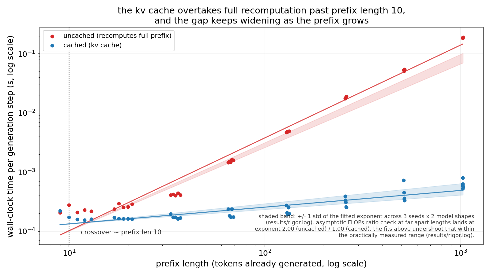

# kv-cache-crossover

> causal self attention from scratch in numpy, with and without a kv cache, measuring the actual per step compute

## what this is

a decoder-only, causal, multi-head self attention transformer is implemented twice from
scratch in numpy, on top of the same fixed (untrained) random weights: once naively, where
every generation step reruns the full forward pass over the entire prefix generated so far,
and once with a key/value cache, where every step only projects the new token and appends its
key and value to what was already computed. the claim under test: producing the t-th token
costs quadratically more compute as t grows under the naive implementation, and linearly more
under the cached one, and the point where the cache actually wins in wall clock time is small
enough to matter in practice. the naive, uncached implementation is the baseline throughout:
same weights, same prompts, timed the same way, with no other reference implementation in
scope.

both implementations run on fully synthetic data: random token id sequences drawn from a
seeded rng, no download or external source. weights are fixed rather than trained, since the
claim is about compute scaling and cache correctness, not learned output quality. correctness
comes first: on a fixed case, `cached`'s logits match `uncached`'s to within `1e-8`, checked
by `tests/test_cached.py`.

timing both implementations across prefix lengths from 8 to 1024 (`results/run.log`) shows the
cache overtaking full recomputation almost immediately:

| prefix length | uncached time per step (s) | cached time per step (s) |
|---|---|---|
| 9 | 0.00020490 | 0.00022173 |
| 33 | 0.00041217 | 0.00019527 |
| 129 | 0.00471533 | 0.00027264 |
| 513 | 0.05356732 | 0.00073009 |
| 1025 | 0.18423034 | 0.00080213 |

the empirical crossover, the smallest sampled prefix length past which the cache measures
faster at every larger length, is `10`; the fitted crossover from the two log-log fits below is
`12.31` (`results/run.log`). fitting the wall-clock numbers directly over this practically
probed range gives exponents of `1.5698` (uncached, `r_squared=0.9780`) and `0.2826` (cached,
`r_squared=0.7856`), both short of the textbook `2` and `1`, because at this model's size the
per-token constant cost is still a real fraction of the length-dependent attention cost even
past a thousand tokens (`results/run.log`). the same undershoot repeats with low seed-to-seed
variance across 3 seeds and 2 model shapes: `1.4536 +/- 0.0396` (uncached) and
`0.2919 +/- 0.0475` (cached), fit over prefix lengths `(8, 32, 128, 512)` (`results/rigor.log`).
evaluated instead at two lengths far enough apart to leave that constant-dominated regime,
`8192` and `1048576`, the same analytic flop counters give exponents of `1.9964` (uncached) and
`0.9964` (cached) for the default model shape, and `1.9929` / `0.9929` for a second, wider and
shallower shape, confirming the asymptotic complexity claim cleanly for both
(`results/rigor.log`).



## run it

1. install the pinned dependencies.

   ```bash
   pip install -r requirements.txt
   ```

2. generate the synthetic sequences and fixed weights, and check their shapes.

   ```bash
   python3 src/data.py
   ```

3. run the naive, uncached generation loop on a synthetic prompt and save its per-step
   timings; this is the baseline everything else is compared against.

   ```bash
   python3 src/uncached.py > results/baseline.log
   ```

4. run the cached implementation on the same prompt and weights, to check it behaves
   correctly before it is timed at scale.

   ```bash
   python3 src/cached.py
   ```

5. sweep both implementations across prefix lengths `8` to `1024`, fit the scaling
   exponents, and find the wall-clock crossover point.

   ```bash
   python3 src/experiment.py > results/run.log
   ```

6. repeat the sweep across `3` seeds and `2` model shapes, and check the asymptotic
   scaling claim directly from flop counts at far-apart lengths.

   ```bash
   python3 src/rigor.py > results/rigor.log
   ```

7. regenerate the headline chart from the committed logs.

   ```bash
   python3 src/plot_headline.py
   ```

8. run the test suite: correctness of the cache against the uncached implementation, and
   the flops-ratio scaling checks, alongside the data-generation tests.

   ```bash
   pytest tests/
   ```

every step above runs on cpu and finishes in well under a 10-minute budget, including the
widest sweep in `src/experiment.py` and the multi-seed, multi-shape sweep in `src/rigor.py`.
